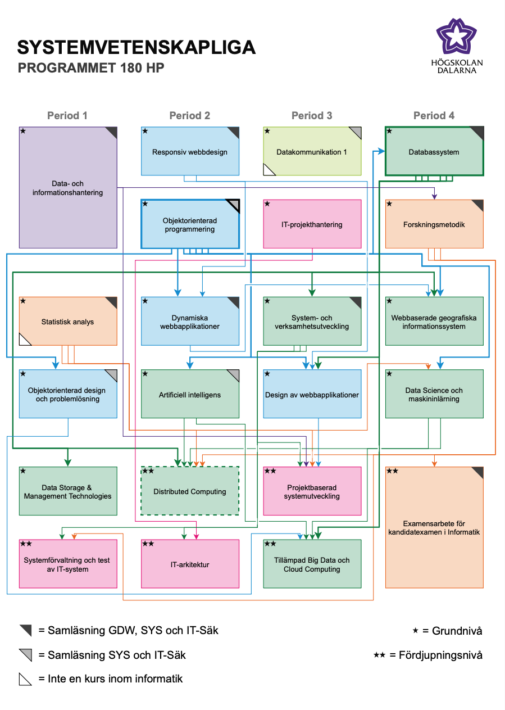

# College Repository

This repository is my complete academic archive from the [Systemvetenskapliga programmet](https://www.du.se/sv/Utbildning/Program/systemvetenskapliga-programmet/) at Högskolan Dalarna.  
It contains **every course, project and assignment** I have completed during my three years of study in Information Systems.

The structure is simple and logical:
- At the top level, folders are organized **by year of study**.
- Inside each year, you’ll find **individual course folders**.
- Each course folder contains **assignments, projects and their solutions**, often with both the original problem statements and my completed work.

Think of it as:
> *A chronological map of my academic journey — from first-year fundamentals to advanced third-year projects — all in one place.*

Whether you’re a fellow student, a potential employer, or just curious about the curriculum, this repository offers a transparent look at the skills, topics and technologies I have worked with throughout my degree.

## Notes for Students

- All material is shared for **educational purposes only**
- Use it to understand structure, expectations, and methodology
- Do **not** submit this work as your own in other courses

##  About the Program: Systemvetenskapliga programmet

The *Systemvetenskapliga programmet* at Högskolan Dalarna is a 3-year (180 ECTS) Bachelor's programme in Information Systems. It equips students with the skills to design, develop, test and manage IT systems tailored to human and organizational needs  [oai_citation:0‡Högskolan Dalarna](https://www.du.se/sv/Utbildning/Program/systemvetenskapliga-programmet/?utm_source=chatgpt.com).

# Interactive PDF: Explore All Courses

In addition to the visual image below, this repository also includes a **clickable PDF** version of the entire *Systemvetenskapliga programmet* course structure:

[**Click here to download the interactive course map (PDF)**](assets/SY_forkunskapskrav_kurser_programmet.pdf)
> Once opened and downloaded, you can open the PDF and click on any course box to view more info about that course on Högskolan Dalarna’s website.

## Visual Overview of all the courses in the program

> Click the image to open the **interactive PDF version** — where each course box is clickable and links to its official course page on Högskolan Dalarna’s website.

This diagram provides a full **visual map of the 3-year Bachelor's Programme in Information Systems** (*Systemvetenskapliga programmet*) at Högskolan Dalarna.

- Each box represents a course, color-coded by semester and category.
- Arrows indicate **prerequisite relationships** between courses.
- Symbols in the corners denote:
  - `★` = Grundnivå (Basic level)
  - `★★` = Fördjupningsnivå (Advanced level)
  - Triangles = Cross-listed or non-informatics courses

This image gives a clear overview of how the programme is structured — from foundational topics in databases and programming to advanced courses in data science, distributed computing and cloud technologies.

### Key Features of the Program

- **Comprehensive Coverage**: Courses span programming, databases, web/mobile development, AI, data science, IT-architecture, project-based development, system testing, Big Data and cloud computing  [citation:1‡Högskolan Dalarna](https://www.du.se/sv/Utbildning/Program/systemvetenskapliga-programmet/).
- **Lifecycle-Based Learning**: The curriculum is structured around the IT system development lifecycle—analysis, design, implementation, testing and maintenance—with increasing complexity across the years  [citation:2‡Högskolan Dalarna](https://duweb-test.du.se/utbildning/program/utbildningsplan/).
- **Real-World Projects**: In later years, students work on projects commissioned by local IT companies, gaining hands-on experience in group-based system development.
- **Strong Industry Link**: The programme emphasizes collaboration with the IT industry through guest lectures, project work and a curriculum aligned with current tech trends  [citation:4‡Högskolan Dalarna](https://www.du.se/en/study-at-du/Program/programme-syllabus/CreatePdf/?alignment=&alignmentid=0&code=DSYPG&id=356&lang=en&type=5&utm).

---

##  Purpose of This Repository

This repository:

- Serves as a structured record of my coursework, projects and solutions.
- Facilitates review and reference for future studies or professional development.
- Demonstrates my academic progression and development as an information systems professional.

---

##  How to Use

- Navigate into a year folder (e.g., `Year-2/`).
- Open a course folder (e.g., `Maskininlärning och Data Science/`).
- Inside, you’ll find:
  - Assignments with clear naming and solutions.
  - Project directories, sometimes with both problem descriptions and completed work.

---

##  Contact

Feel free to open an issue or reach out if you need help navigating the repository or want explanations on specific projects!

---

**Summary**:  
This repository is a well-organized mirror of my journey through the *Systemvetenskapliga programmet* at Högskolan Dalarna—showcasing my assignments, solutions and projects in a structured, year-by-year, course-by-course layout.
