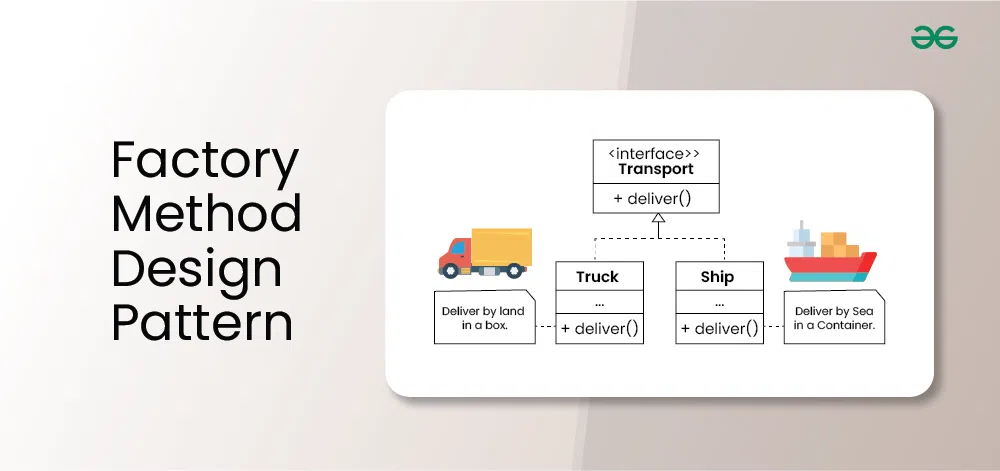

# Object-Oriented Design and Problem Solving

This course contains **notes, clarifications, and projects** related to important object-oriented design principles and design patterns.  

It focuses on applying theory to practice by using **principles such as SOLID** and implementing **design patterns** to solve real-world inspired problems.

---

## Covered Topics

### SOLID Principles
- **Single Responsibility Principle (SRP)**  
- **Open/Closed Principle (OCP)**  
- **Liskov Substitution Principle (LSP)**  
- **Interface Segregation Principle (ISP)**  
- **Dependency Inversion Principle (DIP)**  

### Core Design Patterns
- Creational, Structural, and Behavioral patterns  
- Practical examples of when and how to apply them

---

## Included Project

The course also includes a major project: **Personalregister** – a digital personnel register for managing over **500,000 worker ants**.  
This project demonstrates the use of the **Abstract Factory Pattern** to create and manage different types of personnel (e.g., **ants** and later **bees**).  

### Key Features
- Full **CRUD operations**: add, remove, search, and update employees  
- Simulation of **ant lifespans** (2 weeks) and automatic weekly births  
- Persistent storage using **JSON** instead of traditional RDBMS, to avoid common database vulnerabilities  
- Extendable design: support for adding new species (like bees) with their own classes and factories  

---

## Why It Matters

By combining **theory (principles and patterns)** with a **large-scale project**, this course provided hands-on experience in designing flexible, scalable, and maintainable object-oriented systems.

